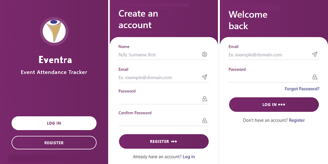

# Eventra

Event Attendance Tracker - Corel Ministry Int'l

[](https://vuejs.org/guide/introduction.html)
[](https://www.typescriptlang.org/docs/)
[](hhttps://console.firebase.google.com/)


## Installation

```
$ git clone https://github.com/2gbeh/eventra.git

$ cd eventra

$ npm install

$ npm run format

$ npm run dev
```

## Usage

> Local:   http://localhost:5173/

## Documentation


